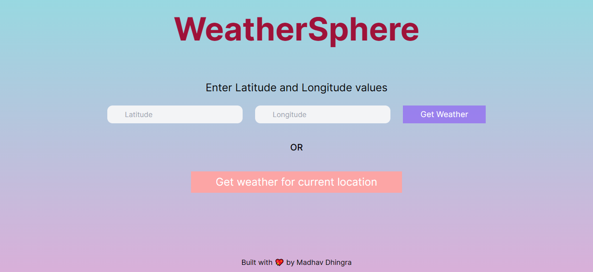
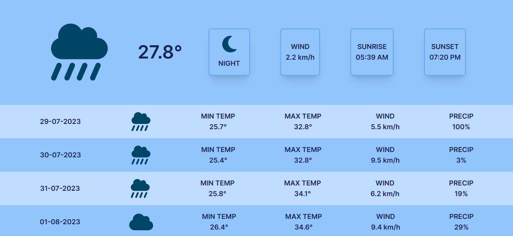
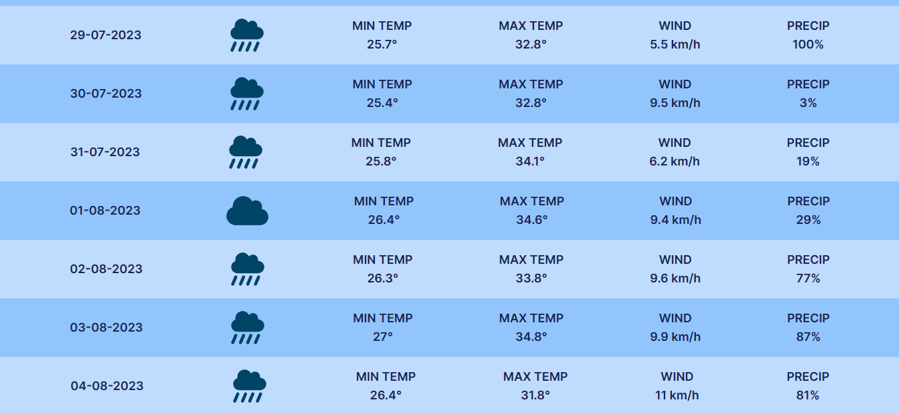

# WeatherSphere 🌍 - A React based Weather App ☁🌡

🌎 **WeatherSphere** is a web app which displays the weather of a location using its coordinates (i.e. latitude & longitude).

💥 Moreover, **WeatherSphere** has the capability to determine the weather of user's current location.

## Deployment 🚀
🔗 Link: https://effulgent-empanada-fd849a.netlify.app/

🌐 Platform: Netlify

## Key Features 🔑🌟
- Gives current temperature 🌡 and wind-speed.
- Displays sunrise 🌄 and sunset 🌇 time as well.
- Shows weekly weather details like min-max temp, wind speed and precipitation probability ☔🌧.

## Technologies Used 👩‍💻
- HTML 💡
- CSS 🎨
- JS 💪
- React 💖
- Tailwind CSS ⭐

## Screenshots 📸

Homepage

Weather page

